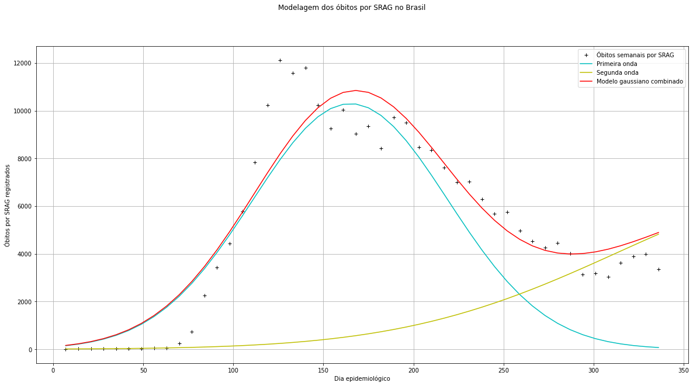

# Prevendo o comportamento da segunda onda de COVID-19 no Brasil utilizando Evolução Diferencial e combinação de pacotes de onda Gaussianos.

  *Analysis of time series datasets of recorded cases and deaths from COVID-19 and cases and deaths from SARS (severe acute respiratory syndrome) using Differential Evolution and the combination of Gaussian wave packets to forecast the behavior of the second wave of COVID-19 in Brazil.*

  Análise de datasets contendo séries temporais de casos e óbitos registrados de Covid-19 e casos e óbitos por SRAG (síndrome respiratória aguda grave) utilizando Evolução Diferencial e combinação de pacotes de onda gaussianos na previsão do comportamento da segunda onda de COVID-19 no Brasil.

## Sobre ED, Gaussianas e COVID-19:

 Evolução Diferencial é um algorítmo evolutivo simples da categoria de algorítmos meta-heurísticos, que através da criação de populações de soluções, suas seleções e recombinações, é capaz de obter um solução ótima ou aproximadamente ótima para um problema.
 
 Desde que tenhamos dados o suficiente, é possível, facilmente, utilizar Evolução Diferencial para ajustar curvas/séries temporais provenientes de fenômenos físicos, por exemplo. Assim, podemos ajustar curvas geradas por fenômenos antropológicos como os relacionados ao COVID-19, desde que escolhamos um modelo matemáticos conveniente, que possa ser ajustado aos dados.

 Pelo Teorema do Limite Central, podemos encontrar que utilizar uma função de distribuição Gaussiana pode aproximar a solução de nosso problema já que variáveis aleatórias independentes podem estar gerando nosso conjunto de dados (na verdade, estas variáveis no caso da análise de dados de COVID-19 são tão independentes assim, logo, o ideal seria utlizar alguma função de distruibuição correspondente à uma Gaussiana Modificada). Apesar de não ser a melhor opção neste caso, podemos utilizar a sobreposição de dois pacotes gaussianos como função objetiva na solução de nosso problema de otimização com Evolução Diferencial. Assim, simplificadamente, podemos escrever:
 
 *f(&alpha;1, &beta;1, &gamma;1, &alpha;2, &beta;2, &gamma;2) = &alpha;1exp[-(x-&beta;1)^2/2&gamma;1^2] + &alpha;2exp[-(x-&beta;2)^2/2&gamma;2^2]*

 E encontrar os parâmeros que melhor ajustam a curva do modelo aos devidos dados utilizando Evolução Diferencial como algoritmo de otimização.

## Ajustando casos de COVID-19:
 
 Ajuste (Média dos parâmetros de 20 runs do algoritmo de ED):
 
 

 
 

 
 Previsão dos próximos dias epidemiológicos (Média dos parâmetros de 20 runs do algoritmo de ED):
 
 

 
 

## Ajustando óbitos por COVID-19:

 Ajuste (Média dos parâmetros de 10 runs do algoritmo de ED):
 
 

 
 

 
 Previsão dos próximos dias epidemiológicos (Média dos parâmetros de 10 runs do algoritmo de ED):
 
 

 
 

## Ajustando casos de SRAG:

 Uma forma de tentarmos prever o comportamento da segunda onda de COVID-19 é analisando os casos e óbitos por Síndrome Respiratória Aguda Grave, já que devido à subnotificação de casos e mortes no Brasil, é possível tentar estimar, por exemplo, óbitos subnotificados por COVID-19 através da análise dos dados de SRAG.

 

 
 

 
 Previsão dos próximos dias epidemiológicos (Média dos parâmetros de 10 runs do algoritmo de ED):
 
 

 
 

## Ajustando óbitos por SRAG:

 

 
 

 
 Previsão dos próximos dias epidemiológicos (Média dos parâmetros de 10 runs do algoritmo de ED):
 
 

 
 

## Prevendo o pior momento da segunda onda de COVID-19 no Brasil:

  
## Referências:

* **"MonitoraCovid-19"** https://bigdata-covid19.icict.fiocruz.br/; (Visualizado em: 03/01/2021) (Daqui foram obtidos os *datasets* utilizados.

* **"InfoGripe"** http://info.gripe.fiocruz.br/; (Visualizado em: 16/05/2020) (Onde os dados são divulgados originalmente. Daqui é possível obter *datasets* mais robustos com registros até o ano de 2009).
